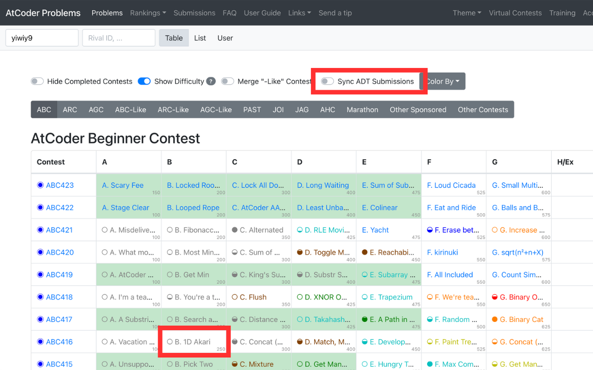
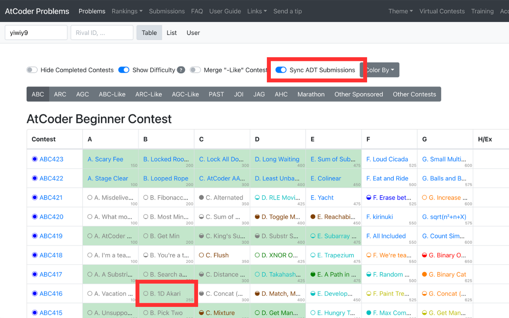

# AtCoder Problems ADT Sync

> [!IMPORTANT]
> This Chrome extension has been discontinued because AtCoder Problems now supports ADT submissions natively.
>
> The extension is no longer available on the Chrome Web Store.
> If you still have it installed, please turn the extension toggle OFF or uninstall it.
>
> This repository will remain available as an archive and reference implementation.

A Rust-based Chrome extension and backend system that integrated AtCoder Daily Training (ADT) submissions into [AtCoder Problems](https://kenkoooo.com/atcoder/) for unified problem-solving progress visualization.

## Overview

AtCoder Daily Training (ADT) is a practice contest series on AtCoder using past problems. Previously, ADT submission data was not reflected in AtCoder Problems in the same way as regular contest submissions.

This project was created to bridge that gap by synchronizing ADT submission data and displaying it within the AtCoder Problems interface.

AtCoder Problems now supports ADT submissions natively, so this extension is no longer needed.

## Demo

Historical demo of the AtCoder Problems "Table" tab with the extension:

* OFF (default): only native AC submissions are highlighted
* ON: ADT submissions are also highlighted in green

<p align="center">
  
  
</p>

## Architecture

```bash
Chrome Extension ──► Backend API ──► DynamoDB
(Rust + WASM)        (AWS Lambda)      (User AC Data)
       │                               ▲
       │                               │
       ▼                               │
AtCoder Problems                Batch Processor
   Website                    (AtCoder Scraper)
```

## Project Structure

* **[`wasm-extension/`](./wasm-extension)**: Chrome extension (Rust + WebAssembly)
* **[`backend/`](./backend)**: AWS Lambda backend with Rust

  * `api/`: REST API for Chrome extension
  * `batch/`: Data crawling and processing
  * `ddb_client/`: DynamoDB operations library ([📊 Architecture & Cost Analysis](./backend/ddb_client/docs/architecture.md))
  * `atcoder_client/`: AtCoder web scraping client

## Technology Stack

* **Frontend**: Rust + WebAssembly (wasm-bindgen)
* **Backend**: Rust + AWS Lambda (Axum)
* **Data**: DynamoDB, AtCoder scraping (reqwest, scraper)
* **Tools**: cargo-lambda, wasm-pack, Docker

## License

MIT License
